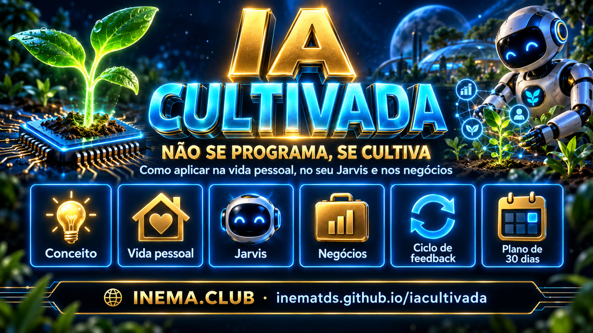

# 🌱 IA Cultivada — não se programa, se cultiva

Os modelos de IA são **cultivados, não construídos**: os laboratórios criam as condições (arquitetura, dados, objetivo, compute, treinamento, feedback) e as capacidades emergem. Este projeto pega essa ideia e mostra **como aplicá-la** em três jardins: a vida pessoal, o seu Jarvis (assistente pessoal agêntico) e os negócios.

## 📖 Página do projeto

**https://inematds.github.io/iacultivada/**

## O que tem aqui

| Pasta | Conteúdo |
|---|---|
| `index.html` | A página única (landing + conteúdo), self-contained, padrão INEMA. |
| `conteudo/` | Os capítulos em markdown: `00-conceito`, `01-vida-pessoal`, `02-jarvis`, `03-negocios`, `04-kit-pratico`. |
| `pesquisa/relatorio-pesquisa.md` | Pesquisa profunda (set/2026): origem do conceito, autoaperfeiçoamento recursivo, adoção nas empresas, agentes pessoais, críticas. Com fontes e com o que **não** foi possível confirmar. |
| `fontes/` | Os dois textos de partida: *IA Cultivada* e *IA Cultivada nas Empresas*. |
| `kits/` | Três kits para baixar (pessoal, Jarvis, empresa): os cinco arquivos já estruturados, com exemplo fictício. Zips e `build.sh`. |
| `skills/` | Skills `/cultivar` e `/revisao-semanal` para Claude Code e Codex, com `install.sh`. |
| `gerador/` | Gerador de ficha do agente, contexto, exemplos, scorecard e diário de falhas (página estática). |
| `diagnostico/` | Diagnóstico de maturidade do cultivo: oito perguntas, nota, por onde começar, kit indicado. |
| `pacotes/` | Pacotes de agentes por área: qualificador de leads (completo, com prompt de sistema e fluxo n8n) e três leves. Modelos, não executados contra CRM ou n8n reais. |
| `capa/capa.png` | Capa oficial do catálogo INEMA. |
| `assets/` | Banner e imagem hero. |

## Soluções prontas

| | Onde |
|---|---|
| Kits para baixar | https://inematds.github.io/iacultivada/kits/ |
| Gerador de ficha | https://inematds.github.io/iacultivada/gerador/ |
| Diagnóstico | https://inematds.github.io/iacultivada/diagnostico/ |
| Skills | `git clone` + `skills/install.sh` (ou `--codex`) |
| Pacotes | `pacotes/` |

Este repositório é um template do GitHub: "Use this template" cria a sua cópia com tudo.

## A ideia em uma linha

> Antes, programávamos o comportamento. Agora, programamos o processo que produz o comportamento.

Os oito elementos do cultivo: **função, contexto, ferramentas, regras, exemplos, memória, avaliação, feedback**. O ciclo: **processo → agente → execução → resultado → avaliação → feedback → agente melhor**.

## Licença

Conteúdo educacional do [INEMA.CLUB](https://inema.club). Pode compartilhar com atribuição.
